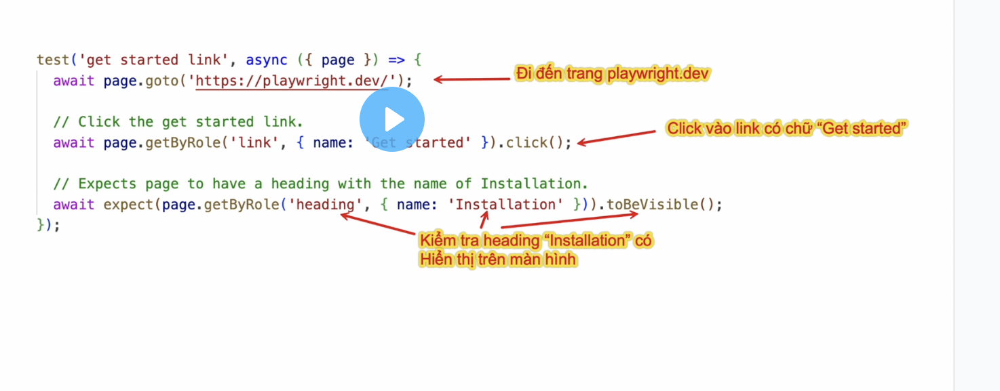
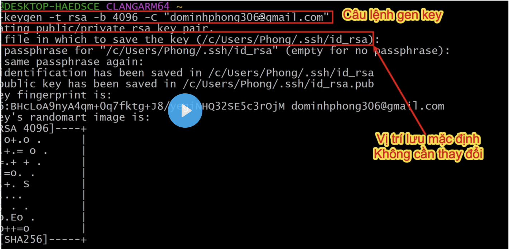

## **1.1:** Playwright là gì?
1. Playwright là một framework (version mới nhất 1.6.2): playwright.dev
2. Ưu điểm playwright: 
- cross browser (chrome, edge, firefox, safari, ...)
- cross platform (code một lần, chạy trên các HĐH: windows, linux, macos)
- tính năng "xịn sò": auto-waiting, aut-retry assertion giúp giảm flaky tests (lúc pass, lúc fail)
- code gen: thao tác để sinh ra code
3. Học playwright: dễ cài đặt, cú pháp đơn giản, framework trending, nhiều cơ hội việc làm

## **1.2**: Giải thích về công cụ NVM, Git, VS Code, cấu hình global cho Git
- **NVM**: Node version Manager: quản lý các phiên bản Node.js
- **NodeJs**: công cụ để chạy code
- **npm**: Gọi công cụ quản lý gói chạy lên.
- **Git**: quản lý source code
- **GitHub**: chia sẻ code, làm việc nhóm

**Cấu hình Git**
1. Config username:
git config --global user.name "<tên bạn>"
2. Config email:
git config --global user.email" <email của bạn>"
3. Config branch default(nhánh mặc định):
git config --global init.defaultBranch main

## **1.3**: Sử dụng VS Code cơ bản 
Cấu hình terminal mặc định [Dành riêng cho Windows]
- Ctrl + shift + P: hiển thị hộp thoại
- Tìm kiếm: Termniate default
- Chọn: Select Default Profile

## **1.4**: Chạy test đầu tiên với Playwright
1. Tạo 1 folder (e.g. "demo-1")
2. Option
2.1 MAC: right click > Open in termial. Nếu ko thấy thì chọn View > Show Path Bar
2.2 Windows: đi vào bên trong folder > right click to select "Show more options" > Open Git Bash here
3. Khởi tạo: npm init playwright@latest
Typescript
tests: true (giữ nguyên)
Github action workflow: false (bấm chữ n)
playwright browser: true (bấm chữ y)
--> hiển thị Happy hacking : là thành công
4. File > Open Folder > Nhớ trust folder
- node_modules: chưa các thư viện của playwright
- tests: chưa file duy nhất ts: example.spec.ts
- gitignore: giúp git bỏ qua phần tracking những phần này
- package-lock.json: khoá các thư viện lại
- package.json: mô tả dự án và các thư viện sử dụng
- playwright.config.ts: file quan trọng gồm nhiều info: tests, browsers

**NOTES**
1. Nếu thấy thiếu nút run >: vào Testing > Test explorer > chọn Refresh
2. Nếu không thấy hiển thị trình duyệt: vào Testing > Playwright: 
- check projects > chromium
- check Settings > Show browser 

## **1.5**: Hiểu "vẹt" code Playwright
code playwright rất dễ hiểu, tương tự như lời thoại
- goto = đi đến
- expect = mong muốn
- toHave.. = có..

**note**
- regex: bao gồm (/playwright/)
-  "": tìm chính xác ("playwright")



## **1.6**: Tạo SSH key, đưa code lên GitHub
**home**
- windows: c:\users\nhu.pham\.ssh
- mac: /users/admin/.ssh

1. Câu lệnh tạo SSH key:

```python
ssh-keygen -t rsa -b 4096 -C "your_email@example.com"
```


2. Read id_rsa.pub 
cat ~/.ssh/id_rsa.pub

3. Copy public key --> GitHub
Settings \ SSH and GPG keys \ Paste key \ verify code from email
 
```
Create new repository \ select Public 
Go to SSH tab, copy url (e.g. git@github.com:quynhnhulp/demo-01.git)
```
4. VS code \ Open terminal:
- Câu lệnh khởi tạo repo Git: git init
- Câu lệnh add remote git: git remote add origin <remote url>
- Câu lệnh thêm code vào vùng staging: git add .
- Câu lệnh commit với comment: git commit -m"init project"
- Câu lệnh push code lên GitHub: git push origin main
