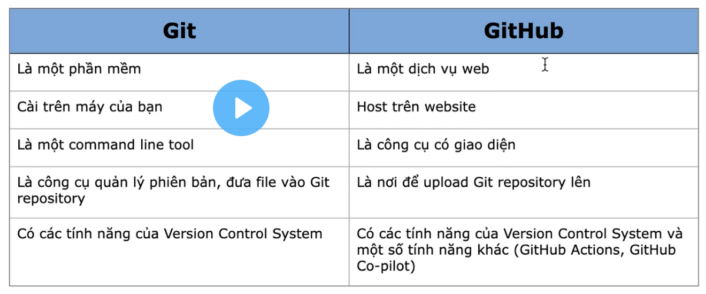
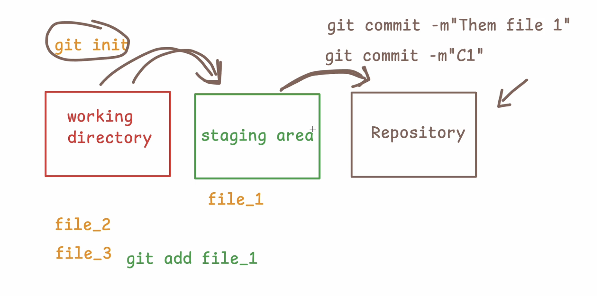
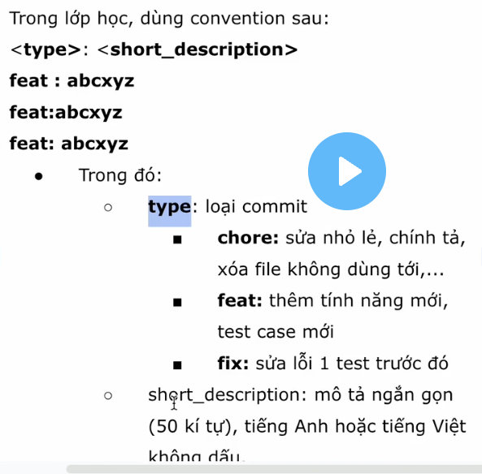
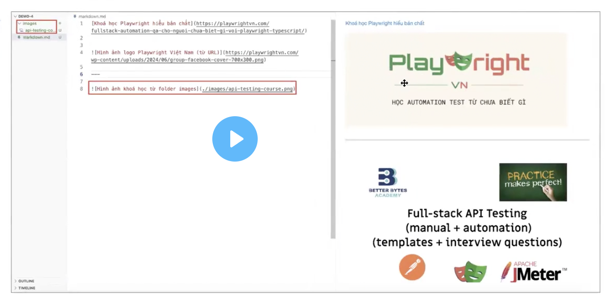

## 2.1 Tổng quan về Git

- GIT (Global Information Tracker): Free, dễ dùng, có nhiều tính năng vượt trội: branching, tốc độ xử lý nhanh
- Git vs GitHub


## 2.2 Ba vùng trong Git
Ba vùng trong Git lần lượt là:
- Working Directory: chứa các công việc đang làm dở
- Staging Area: vùng đệm, chứa các công việc đã sẵn sàng - cho lần commit tiếp theo
Repository: chứa danh sách các commits

git init // tạo ra 3 vùng: working directory  - staging area - repository 

git add <ten_file>
git add . ==> add toàn bộ file
git add <file_1> <file_2>

git commit -m"message"



```python
Vùng working directory trong Git dùng để làm gì?
Là thư mục làm việc thực tế, nơi bạn xem và chỉnh sửa file trực tiếp

Vùng staging trong Git có tác dụng gì?
Chứa các thay đổi đã được chọn để đưa vào commit tiếp theo


Vùng repository trong Git dùng để làm gì?
ưu trữ vĩnh viễn toàn bộ lịch sử commit, branch, tag và metadata của dự án

```

## 2.3 Kiểm tra trạng thái với: git status
trước khi commit, luôn xem trạng thái với git status
```python
On branch main
Changes not staged for commit:
  (use "git add <file>..." to update what will be committed)
  (use "git restore <file>..." to discard changes in working directory)
        modified:   demo-1.md

Untracked files:
  (use "git add <file>..." to include in what will be committed)
        convention.png
        demo-2.md
        git-github.png
        git.png
```

## 2.4 Xem danh sách commits với git log
xem Danh sách các commit, kèm với tên, email của tác giả và commit message

## 2.5 Cấu hình với git config
mục đích nói cho git biết bạn là ai, email của bạn là gì
- Config username:
git config --global user.name "<tên bạn>"
- Config email:
git config --global user.email "<email của bạn>"
- Config branch default(nhánh mặc định):
git config --global init.defaultBranch main

```python
git config --list
```

## 2.6 Git convention (qui tắc)
```
git commit -m"fix: update code for PRD-002 / fix automation for case 1"
git commit -m"fix: add code for PRD-003/exercise 2"
git commit -m"fix: prevent crash when password is empty"
git commit -m"chore: remove unuse code"
git commit -m"chore: add comment to function"
```



## 2.7 Giới thiệu về Javascript
- JavaScript: là 1 ngôn ngữ lập trình, giúp cho browser được hoạt động. Bình thường JavaScript chạy dc do browser engine support (Chrome: V8)
 - Khi chạy trên máy tính ko có browse engine: 
 ==> cần công cụ khác để chạy khác
 ==> NodeJS

## 2.8 Chương trình đầu tiên - Hello World
console.log("Hello World");

## 2.9 Comment trong JavaScript
 chạy file: node <ten_file>
 ```
 // comment: là cách vô hiệu hoá tạm thời 1 đoạn code (ko dc thực thi)
 /* ... */ Comment nhiều dòng
 ```

 ## 2.10 Biến và Hằng trong JavaScript
 1. **Biến**: biến thiên, có thể thay đổi. Khai báo: let <tên biến> = <giá trị>;
 Ví dụ: let myName = "Như";
 2. **Hằng**: hằng số, ko thay đổi được.
 Ví dụ: const PI = 3.14;

 ## 2.11 Kiểu dữ liệu trong JavaScript
 1. **Number**: 
 - số nguyên (10) và số thực (10.5) ==> in ra màu vàng
 - Số infinity: const number = 1000/0;==> in ra Infinity (Vô hạn))
 - Ko phải số:  const number = 1000 / 'Xin chào' ==> in ra NaN (Not a number)
 2. **String** : in ra màu đen
 - Dùng nháy kép ", nháy đơn ', backtick ` (dấu huyền cạnh số 1)
 3. **Boolen**: Giá trị logic (true/false)
 const isLoveWorking = false;

```python
muốn biết kiểu dữ liệu nào: console.log(typeof isLoveWorking);
```
## 2.12 Toán tử so sánh:
```
const a = 10;
const b = 20;
console.log(a < b); ==> true

>> So sánh hai bằng == (So sánh giá trị sau khi chuyển đổi kiểu)
5 == "5" ==> true
5 == "6" ==> false

const b = 10;
const c = '10';
console.log(b === c); ==> false (ktra nghiêm ngặt cả type & value)
console.log(b == c); ==> true (ktra lỏng lẻo, chỉ ktra value)

console.log(b!== c); ==> true (ktra khác nhau nghiêm ngặt)
onsole.log(b!== c); ==> false (ktra khác nhau lỏng lẻo, ko khác nhau, nó giống nhau vì chỉ ktra value 10)
```

## 2.13 Toán tử toán học
là thực hiện các phép toán: +, - , *, /
```python
console.log(a + b); ==> 30
console.log(a / 0); ==> Infinity
```

## 2.14 Toán tử logic
dùng để kết hợp nhiều điều kiện và trả về boolen
- && (AND): trả về đúng nếu cả 2 vế của mệnh đề đúng
- || (OR): trả về đúng nếu 1 trong 2 vế của mệnh đề đúng

```python
const a = true;
const b = false;
console.log(a && b); ==> false
console.log(a || b); ==> true
```

## 2.15 Toán tử một ngôi
Là toán tử chỉ cần một toán hạng để thực hiện

- prefix: toán tử nằm ở phía trước - tăng trước, trả về sau
++x;
--x;
- postfix: toán tử nằm ở phía sau - trả về trước, tăng sau
x++;
x--;

```python
let x = 100;
console.log(++x); // 101
console.log(x); // 101

let x = 100;
console.log(x++); // 100
console.log(x); // 101
```

let x=5;
x++;
++x;
x--;
--x;

## 2.16 Toán tử chia dư (%)
+ % sẽ trả về phần dư của phép tính.
+ Giả sử:
```
– 3%3 = 0 (vì 3 chia hết cho 3 dư 0)
– 3%2 = 1 (vì 3 không chia hết cho 2, dư 1)
– 3%1 = 0 (vì 3 chia hết 1 dư 0)
– 1%2 = 1 (vì 1 không chia hết cho 2, dư 1)
– 100%80 = 20 (vì 100 không chia hết cho 80, dư 20)
```
Ứng dụng tìm số chẵn, lẻ:
+ Nếu là số lẻ, chia dư cho 2 = 1: x % 2 === 1
+ Nếu là số chẵn, chia dư cho 2 = 0: x % 2 === 0


## 2.17 In kết hợp giá trị chuỗi và biến với console.log()
Ở bài học, ta đã biết dùng console.log(“message”) để in ra giá trị kiểu chuỗi, hay
console.log(<variable_name>) để in ra giá trị của biến.

Để in ra kết hợp giá trị kiểu chuỗi và giá trị của biến, ta có hai cách như sau:
```
Cách 1:
console.log("Dùng dấu cộng như sau: " + name);

Cách 2:
console.log("Hoặc dùng dấu phẩy: ", name);
```
## 2.18 Nối chuỗi với toán tử +

Để nối chuỗi từ hai biến, ta sử dụng dấu cộng (+):
```
const str1 = "Hello";
const str2 = "Playwright Viet Nam"
console.log(str1 + str2); // HelloPlaywright Viet Nam
```

## 2.19 Javascript vòng lặp
Vòng lặp dùng để lặp lại 1 đoạn logic. Có thể lặp một số lần nhất định, hoặc lặp vô hạn, tuỳ theo điều kiện dừng

```
for (let i=0; i<1000, i++){
  console.log("Hello World");
}

Trong JS có các loại vòng lặp: 
for(i)
for(of)
for(each)
for(in)
while
do...while
```

## 2.20 Format code
- Mac: Option + Shift + F
- Window: Alt + Shift + F

## BONUS: MARKDOWN
1. Một ngôn ngữ đánh dấu văn bản, cho phép định dạng văn bản bằng cách sử dụng các ký tự đơn giản, dễ đọc, dễ hiểu
2. Tại sao nên học Markdown?
- Tạo documentation cho automation framework (viết tài liệu  HDSD framework, API documentation)
- Ghi chú và chia sẻ kiến thức
- Phần lớn công cụ AI thích markdown (ChatGPT, Claude, ...) đều sử dụng cú pháp markdown
3. Cú pháp Markdown

3.1/ Tiêu đề (Headers)
```markdown
# Tiêu đề cấp 1 (H1)
## Tiêu đề cấp 1 (H2)
```
3.2/ Định dạng văn bản Text Emphasis
- **Chữ in đậm** hoặc __Chữ in đậm__
- *Chữ in nghiêng* hoặc _Chữ in nghiêng_
- ***Chữ vừa đậm vừa nghiêng*** 
- ~~Chữ gạch ngang~~
- `Code in line`

3.3/ Danh sách (Lists)

**Danh sách không thứ tự**
Dấu - hoặc * hoặc +
```markdown
- Mục 1
- Mục 2
  - Mục con 2.1
  - Mục con 2.2
- Mục 3
```

**Danh sách có thứ tự**
```markdown
1. Mục 1
2. Mục 2
  1. Mục con 2.1
  2. Mục con 2.2
3. Mục 3
```

3.4/ Link hay Image


3.5/ Code Blocks
```Typescript
text - description
```

3.6/ Block quotes
```block
> Đây là một blockquote
> Có thể viết nhiều dòng
>> Nested blockquote
```

3.7/ Đường kẻ ngang
---
hoặc 
***
hoặc
___

3.8/ Bảng

| Test Case ID | Description | Status |
|--------------|-------------|--------|
| TC001 | Login test | Pass |
| TC002 | Logout test | Pass |
| TC003 | Search test | Fail |

| Name | Age | Role |
|---|---:|---|
| Ha | 35 | QA |
| An | 30 | Developer |
| Linh | 28 | BA |

