## 1. Object
- Object (đối tượng): là kiểu dữ liệu dùng để lưu trữ một tập hợp các cặp key - value (khoá - giá trị)
- Qui tắc nhớ: object giống như một hồ sợ (record) - mỗi mục trong hồ sơ có tên (key) và nội dung (value)
```
let sinhVien = {
    hoTen: "Pham Quynh Nhu";
    tuoi: 28;
    lop: "Playwright";
    'gioi tinh': "nữ"
};

// Truy xuất dữ liệu trong Object
console.log(sinhVien.hoTen); // dấu chấm
console.log(sinhVien.["hoTen"]); // dấu ngoặc vuông
console.log(sinhVien['gioi tinh']); 

// Gán gía trị cho Object (Sửa giá trị)
sinhVien.tuoi = 27;
console.log(sinhVien.hoTen); // 27

// Thêm, sửa, xoá thuộc tính
sinhVien.thich = "âm nhạc"; // thêm bằng dot
sinhVien["diaChi"] = "NTP"; // thêm bằnb bracket
console.log(sinhVien) //  hoTen: "Pham Quynh Nhu";tuoi: 28;lop: "Playwright";'gioi tinh': "nữ";thich: "âm nhạc"

// Xoá
delete sinhVien.thich;

// Object lồng nhau:
let sinhVien = {
    hoTen: "Pham Quynh Nhu",
    tuoi: 28,
    diaChi: {
        soNha: "1",
        duong: "NTP",
        thanhPho: "TPHCM"
    }
};
```

- Qui tắt đặt tên key: key thường là string
  + Key có dấu cách hoặc ký tự đặc biệt: cần ngoặc kép
  + Key bình thường: ko cần


## 2. Array
- Array (Mảng) là kiểu dữ liệu dùng để lưu trữ danh sách có thứ tự các giá trị
- Qui tắc nhớ: Array giống một danh sách đánh số - mỗi phần tử có vị trí (index) bắt đầu từ 0

```
let monHoc = ["Toán", "Lý", "Hoá", "Anh"]

// Truy xuất dữ liệu trong Array
console.log(monHoc[0]); // Toán - phần tử đầu tiên
console.log(monHoc[5]); // Undefined - ko tồn tại

//Lấy phần tử cuối cùng:
let cuoi = monHoc[monHoc.length - 1]; // "Anh"

// Đếm số phần tử: .length
const diem = new Array(10, 9, 6, 7.5, 2, 4);
console.log(diem.length); // 6
console.log(diem[diem.length-1]); // 4

// Gán lại giá trị theo index:
monHoc[1]= "Hoá";

//Thêm, xoá phần tử
- Thêm vào cuối mảng: .push();
monHoc.push("Hoá");
- Xoá phần tử cuối: .pop();
let monBiXoa = monhoc.pop();
- Thêm vào đầu mảng: .unshift();
monHoc.unshift("Đức");
- Xoá phần tử đầu: .shift();
monHoc.shift();
```
- Array có thể chứa nhiều kiểu dữ liệu khác nhau (nhưng thực tế nên dùng cùng kiểu)

## 3. Kết hơp Array với vòng lặp
- Đây là sức mạnh của Array - xử lý hàng loạt dữ liệu
- Dùng "for" truyền thống
```
let diemSo = [8, 6, 9, 7, 10];
for (let i=0; i < diemSo.length; i++){
    console.log("Học sinh" + (i+1) + ": " + diemSo[i] + " điểm");
// console.log(`Học sinh ${i+1}: ${diemSo[i]} điểm`);
}// Học sinh 1: 8 điểm
```

## 4. Javascript - Function
- Function (Hàm) là 1 khối lệnh được đặt tên, có thể gọi lại nhiều lần mà ko cần viết lại code 
- Giải pháp: dùng Function
```
// Khai báo 1 lần 
function chaoMung(soThuTu, tenBaiHoc){
    console.log("=====================");
    console.log("Xin chào! Chào mừng đến với Hoctest.com");
    console.log("=====================");
    console.log(`Bài ${soThuTu}: ${tenBaiHoc});
}
// Gọi bao nhiêu lần tuỳ thích
chaoMung(1, "Bài học về Array");
```
- Function với tham số
```
function chao(ten){ // parameter
    console.log("Xin chào " + ten + "!");
}
// chao("Lan"); // Xin chào Lan! // argument
```

- Parameter vs Argument
+ Paramater (tham số - biến giữ chỗ khi khai báo)
+ Argument (đối số - giá trị thật khi gọi)

## 5. Javascript - Array util
### 5.1 map
Tạo mảng mới bằng cách áp dụng 1 hàm lên từng phần tử của mảng gốc. Trả về mảng mới có cùng độ dài
```
const numbers = [1, 2, 3, 4, 5];
const doubled = numbers.map(num => num * 2);


const students = ['An', 'Bình', 'Cường'];
const studentList = students.map((name, index) => 
({
    id: index + 1;
    name: name;
    code: `SV00${index + 1};
}));

console.log(studentList);
// {id: 1, name: 'An', code: 'SV001'}
// {id: 2, name: 'Bình', code: 'SV002'}
// {id: 3, name: 'Cường', code: 'SV003'}

```

### 5.2 filter
- Tạo mảng mới chỉ chứa các phần tử thoả mãn dk trong hàm callback. Trả về mảng đã chọn lọc
```
const numbers = [1, 2, 3, 4, 5, 6, 7, 8, 9, 10];
const evenNumbers = number.filter(num => num % 2 == 0);

console.log(evenNumbers); // [2, 4, 6, 8, 10]
```

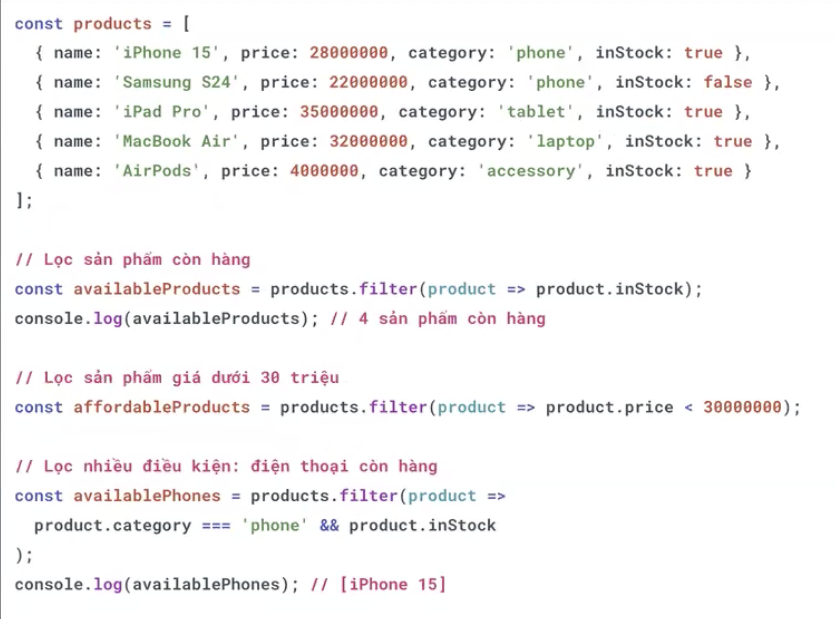

### 5.3 find
- Tìm và trả về phần tử đầu tiên trong mảng thoả mãn điều kiện. Trả về underfined nếu ko tìm thấy.
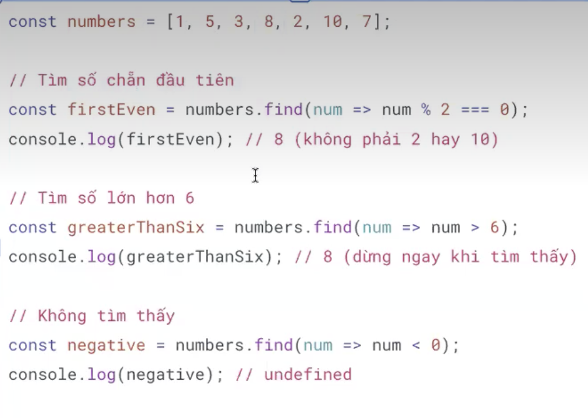

### 5.3 Array until
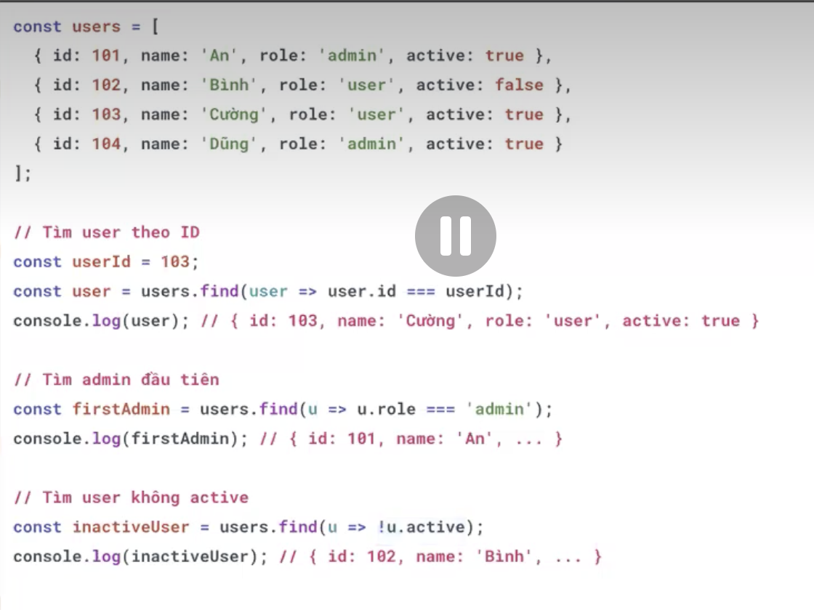

### 5.4 reduce
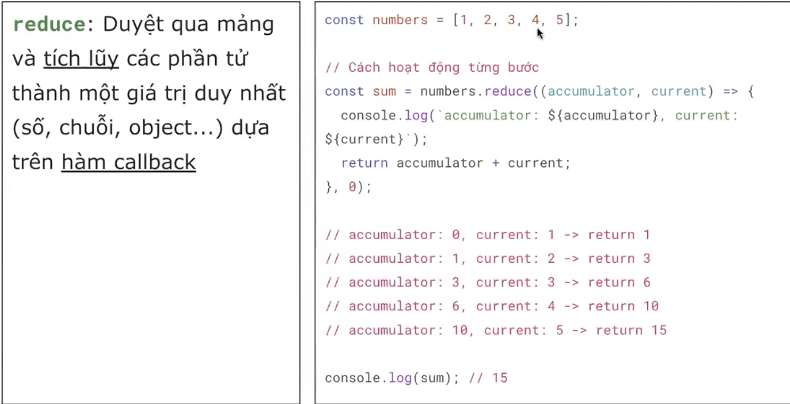
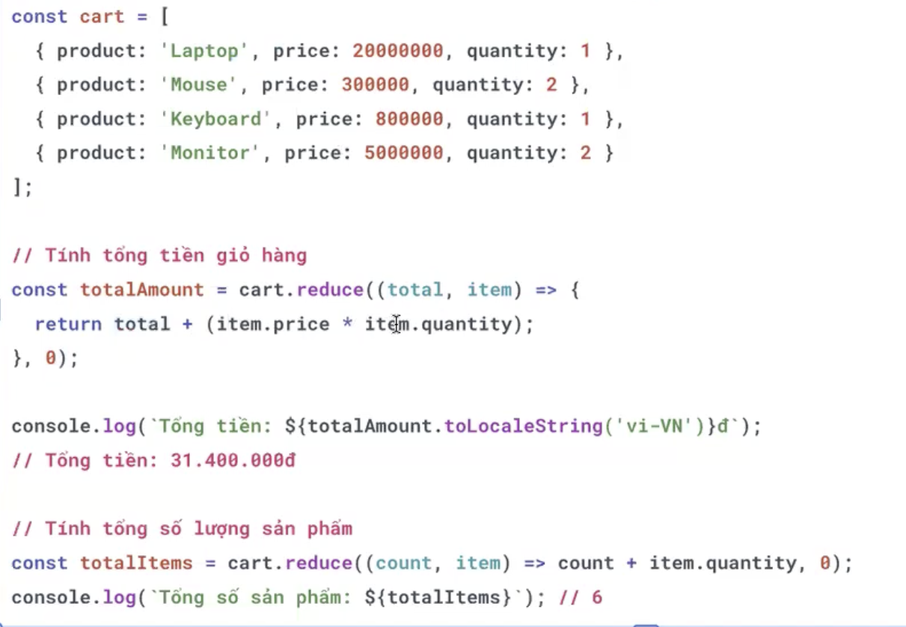

### 5.5 some
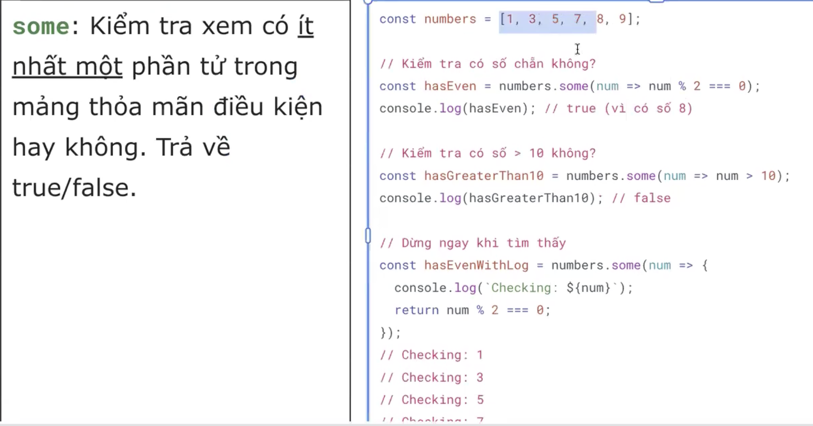
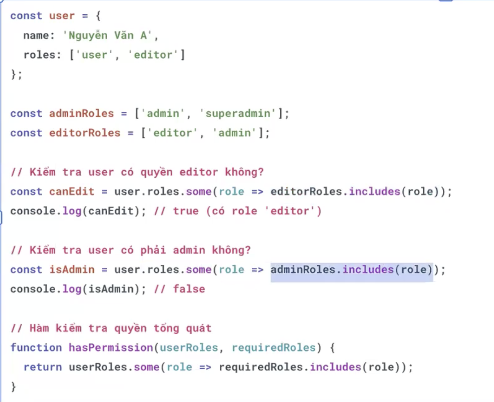

### 5.5 every
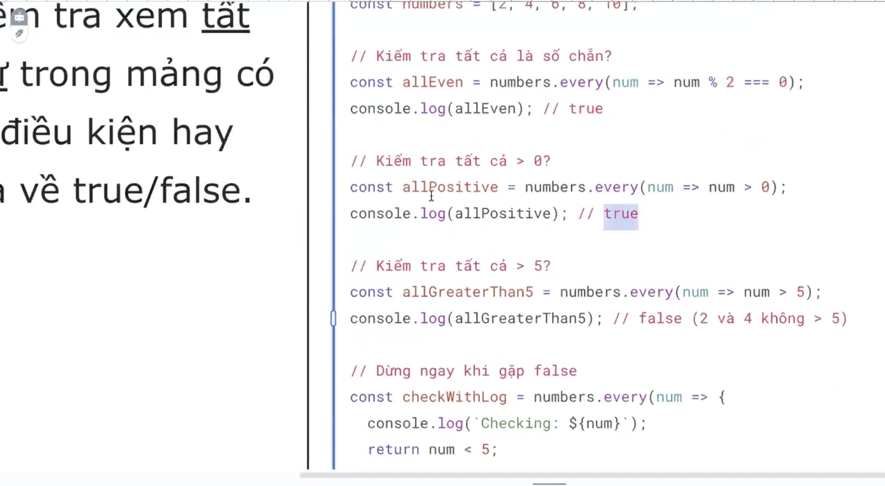

### 5.6 sort
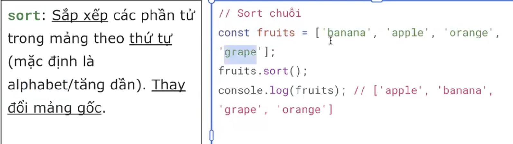
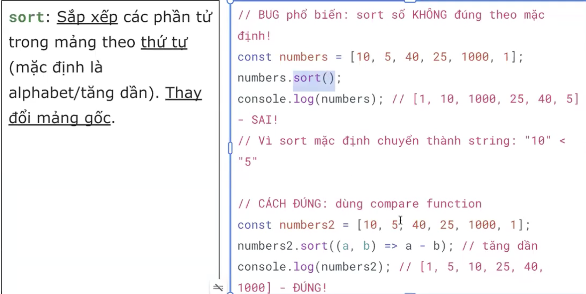
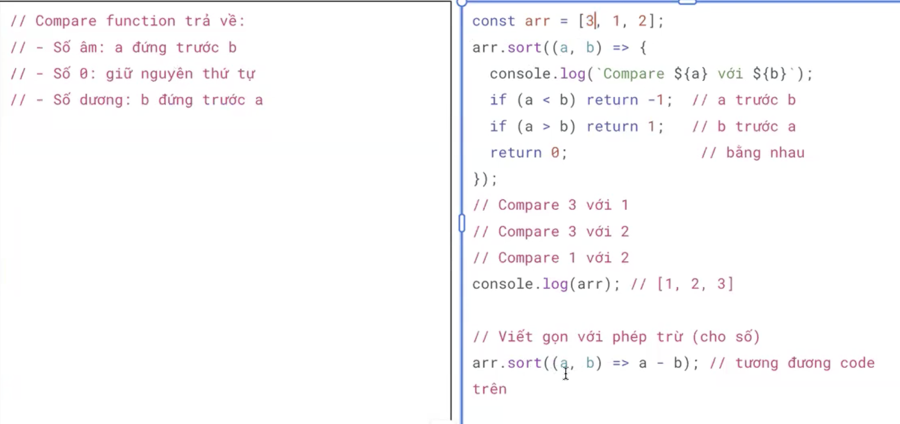

### 5.7 push
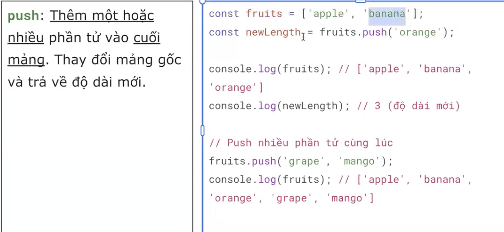
 
### 5.8 pop
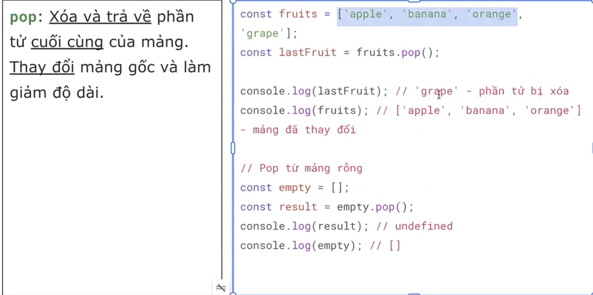

### 5.9 shift
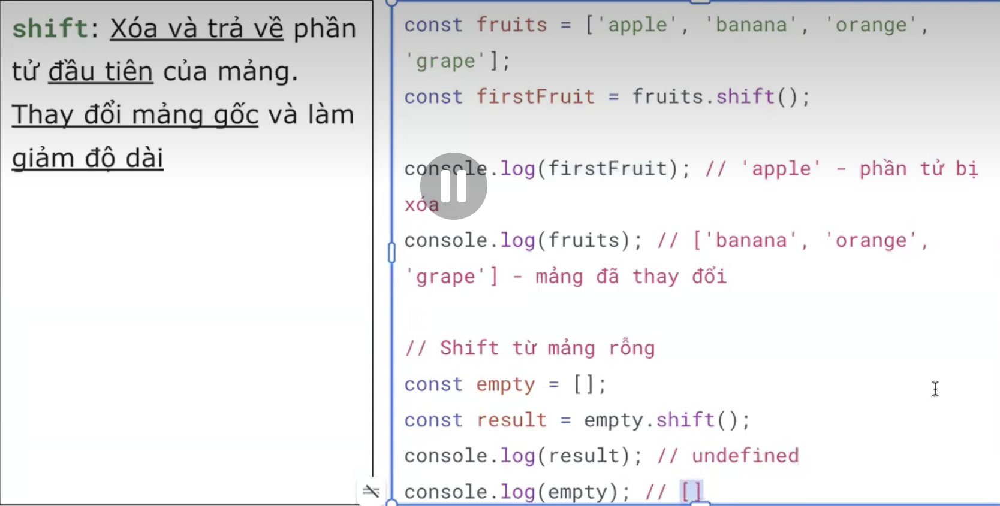

### 5.10 unshift
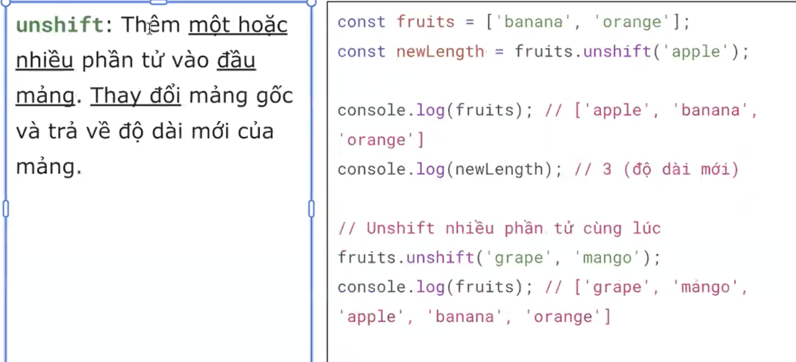
